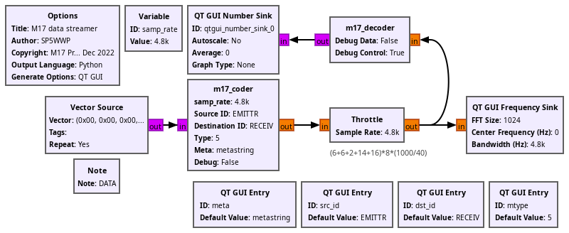

## Compiling for GNU Radio

The default targetted version is GNU Radio 3.10 (``main`` branch). For GNU Radio 3.8,
insert ``git checkout 3.8`` after the ``git clone ...`` command and check the 3.8 branch
version of the README.md for ``LD_LIBRARY_PATH`` and ``PYTHONPATH`` tested on Debian/stable.

```
git clone --recursive https://github.com/M17-Project/gr-m17
cd gr-m17
mkdir build
cd build
cmake ../
make -j12
sudo make install
```

will finish with a statement such as
```
-- Set runtime path of "/usr/local/lib/python3.11/dist-packages/gnuradio/m17/m17_python.cpython-311-x86_64-linux-gnu.so" to ""
```
meaning that variables must be set (tested with Debian/sid) to help GNU Radio Companion find the Python libraries:

```
export LD_LIBRARY_PATH=$LD_LIBRARY_PATH:/usr/local/lib/x86_64-linux-gnu/
export PYTHONPATH=/usr/local/lib/python3.11/dist-packages/
```

where the ``LD_LIBRARY_PATH`` setting results from

```
find /usr/local/ -name libgnuradio-m17.so.1.0.0 -print
```

When running the flowgraph found in ``examples`` with ``gnuradio-companion ../examples/m17_streamer.grc`` 



the output should be

```
Generating: '.../M17_Implementations/SP5WWP/gr-m17/examples/m17_streamer.py'

Executing: /usr/bin/python3 -u .../M17_Implementations/SP5WWP/gr-m17/examples/m17_streamer.py

new meta: helloworld
new SRC ID: 1 2 3 4 5 6
new DST ID: 255 255 255 255 255 255
New sampling rate: 8800.000000
new type: 0 0
got_lsf=1
LSF
DST: #BCAST    SRC: FPR-4U3F  TYPE: 0000 META: 68656C6C6F776F726C6400000000 LSF_CRC_OK 
FN: 0000 PLD: 00000000000000000000000000000000
FN: 0001 PLD: 00000000000000000000000000000000
FN: 0002 PLD: 00000000000000000000000000000000
FN: 0003 PLD: 00000000000000000000000000000000
FN: 0004 PLD: 00000000000000000000000000000000
DST: #BCAST    SRC: FPR-4U3F  TYPE: 0000 META: 68656C6C6F776F726C6400000000 LSF_CRC_OK 
FN: 0005 PLD: 00000000000000000000000000000000
FN: 0006 PLD: 00000000000000000000000000000000
FN: 0007 PLD: 00000000000000000000000000000000
FN: 0008 PLD: 00000000000000000000000000000000
FN: 0009 PLD: 00000000000000000000000000000000
FN: 000A PLD: 00000000000000000000000000000000
DST: #BCAST    SRC: FPR-4U3F  TYPE: 0000 META: 68656C6C6F776F726C6400000000 LSF_CRC_OK 
FN: 000B PLD: 00000000000000000000000000000000
FN: 000C PLD: 00000000000000000000000000000000
FN: 000D PLD: 00000000000000000000000000000000
FN: 000E PLD: 00000000000000000000000000000000
FN: 000F PLD: 00000000000000000000000000000000
```

**Warning**: the default gr_modtool informs GNU Radio Companion to ``import m17`` rather than
``from gnuradio import m17``. This has to be changed in the YML files manually as the template
is erroneous.

## Developer note1

In case of error related to ``Python bindings for m17_coder.h are out of sync`` after changing
header files in ``include/gnuradio/m17``, make sure that 
```
md5sum include/gnuradio/m17/m17_decoder.h
```
match the information in ``python/m17/bindings/*cc``.

Rather than manually changing the md5sum, the proper way of handling bindings in the Python directory is to execute
```
gr_modtool bind m17_decoder
gr_modtool bind m17_coder
``` from the gr-m17 directory, assuming ``gr_modtool bind`` works, otherwise check https://github.com/gnuradio/gnuradio/issues/6477


## Developer note2

The coder block is an interpolating block outputing 24 more times samples than input symbols. The (well named) ``noutput_items``
it the **output** buffer size which fills much faster than the input stream so we fill ``out`` until ``noutput_items`` are reached, then
send this to the GNU Radio scheduler, and consume the few input samples needed to fill the output buffer. The ring buffer mechanism of GNU Radio makes sure the dataflow is consistent.

## TODO:
* How to handle fixed symbol rate but varying output rate?
* How to modulate the RF transmitted with the real output?
