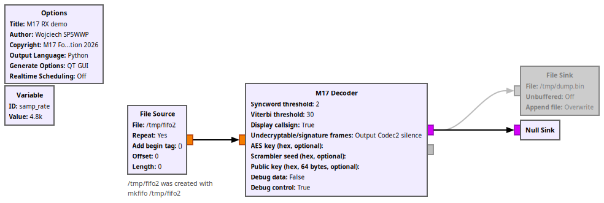
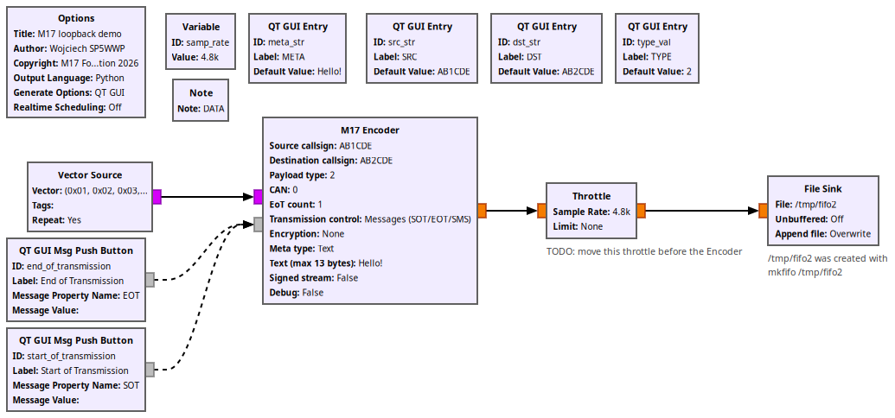
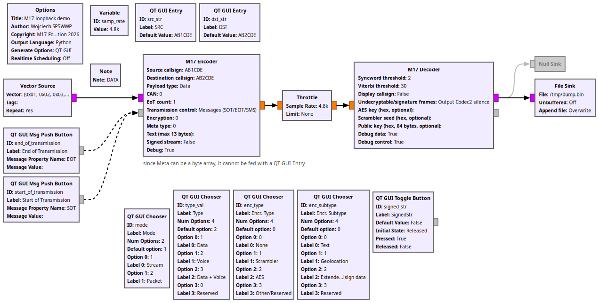
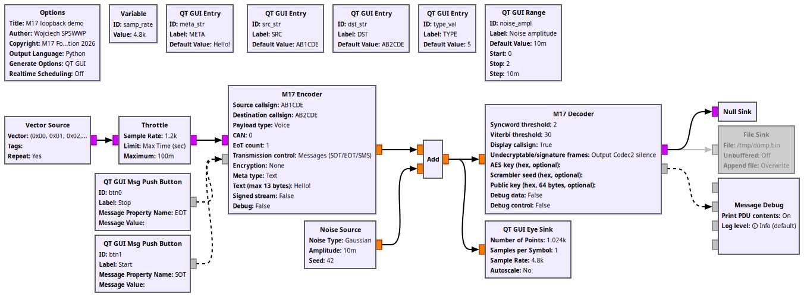
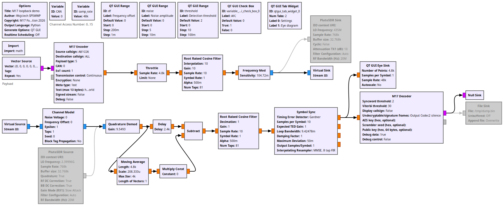
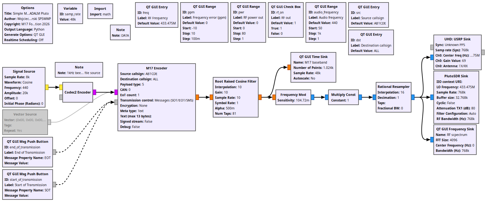
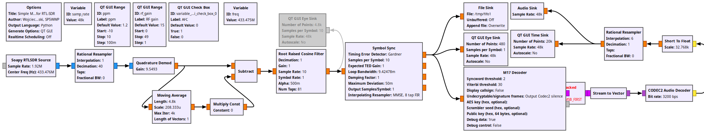
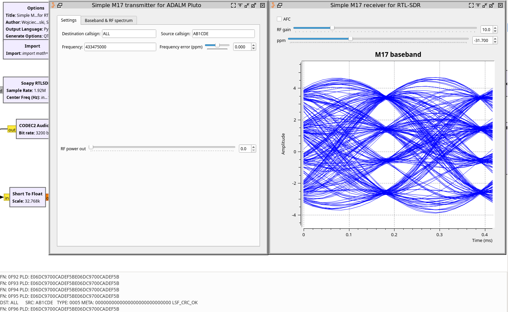

## gr-m17 examples

For a first test, jump to ``m17_loopback.grc`` which does not use external tools but is GNU Radio only.
The two ``m17_rx.grc`` and ``m17_tx.grc`` are for debugging and validation purposes of the conversion
from ``libm17`` to GNU Radio block.

### m17_rx.grc



This receiver testing example relies on ``../M17_Implementations/SP5WWP/m17-coder/m17-coder-sym``
to broadcast a signal. Following this unit testing example, run this flowchart along with
```
mkfifo /tmp/fifo0
mkfifo /tmp/fifo2
python3 ../M17_Implementations/SP5WWP/grc/m17_streamer.py
../M17_Implementations/SP5WWP/m17-coder/m17-coder-sym < /tmp/fifo0 > /tmp/fifo2 &
```

where ``m17_streamer.py`` is generated from ``m17_streamer.grc`` (set its File Source to a local Codec2 file first).
For a plain voice stream from N0CALL to @ALL, the output of ``python3 ./m17_rx.py`` should be similar to

```
15:12:08.338 [M17_DEC] Ready: syncword threshold 2.0, Viterbi threshold 30.0, no AES key, no scrambler seed, no public key, debug control on
15:12:08.338 [M17_DEC] RX start: N0CALL -> @ALL, TYPE 0005 (voice stream, no encryption, CAN 0), no META, e=0.0
15:12:08.355 [M17_DEC] LSF (LICH) unchanged
15:12:08.356 [M17_DEC] LSF (LICH) unchanged
...
15:12:08.356 [M17_DEC] RX end: 40 frames, max e=0.0
```

### m17_tx.grc



This transmitter testing example relies on ``../M17_Implementations/SP5WWP/m17-decoder/m17-decoder-sym``
to decode a signal. Following this unit testing example, run this flowchart along with
```
mkfifo /tmp/fifo2
../M17_Implementations/SP5WWP/m17-decoder/m17-decoder-sym -c -m -l -v < /tmp/fifo2
```

and with ``python3 ./m17_tx.py`` running, the output of ``m17-decoder-sym`` should be
```
{LSF} DST: AB2CDE    SRC: AB1CDE    TYPE: 0005 (STREAM: VOICE, ENCR: PLAIN, CAN: 0) META: 1148656C6C6F2120202020202020 LSF_CRC_OK e=0.0
FN: 0000 PLD: 01020304050600000000000000000000 e=0.0
FN: 0001 PLD: 01020304050600000000000000000000 e=0.0
FN: 0002 PLD: 01020304050600000000000000000000 e=0.0
FN: 0003 PLD: 01020304050600000000000000000000 e=0.0
FN: 0004 PLD: 01020304050600000000000000000000 e=0.0
...
```

### m17_loopback.grc

Loopback demo with TX and RX both in GNU Radio.



The output should be similar to

```
15:10:25.898 [M17_ENC] Ready: AB1CDE -> AB2CDE, TYPE 0005 (voice stream, no encryption, CAN 0), no META, debug on
15:10:25.898 [M17_ENC] TX start: stream (continuous mode)
15:10:25.898 [M17_DEC] Ready: syncword threshold 2.0, Viterbi threshold 30.0, no AES key, no scrambler seed, no public key, debug data on, debug control on
15:10:26.018 [M17_DEC] RX start: AB1CDE -> AB2CDE, TYPE 0005 (voice stream, no encryption, CAN 0), no META, e=0.0
15:10:26.046 [M17_DEC] FN 0000  01020304 05060000 00000000 00000000  e=0.0
15:10:26.098 [M17_DEC] FN 0001  01020304 05060000 00000000 00000000  e=0.0
15:10:26.098 [M17_DEC] FN 0002  01020304 05060000 00000000 00000000  e=0.0
...
15:10:26.218 [M17_DEC] LSF (LICH) unchanged
...
```

### m17_loopback_noisy.grc

Loopback demo with the addition of noise, no modulation/no channnel.



### m17_loopback_noisychannel.grc

Loopback demo with a noisy channel, including full modulation & demodulation.



### transmitterPLUTOSDR.grc

M17 transmitter with ADALM Pluto SDR or Ettus Research B210.



### receiverRTLSDR.grc

M17 receiver with RTL-SDR. Automatic Frequency Correction can be enabled as an option.



### Complete demonstration

Resulting demonstration of wireless communication between a B210 emitting the signal and RTL-SDR dongle
as receiver.


