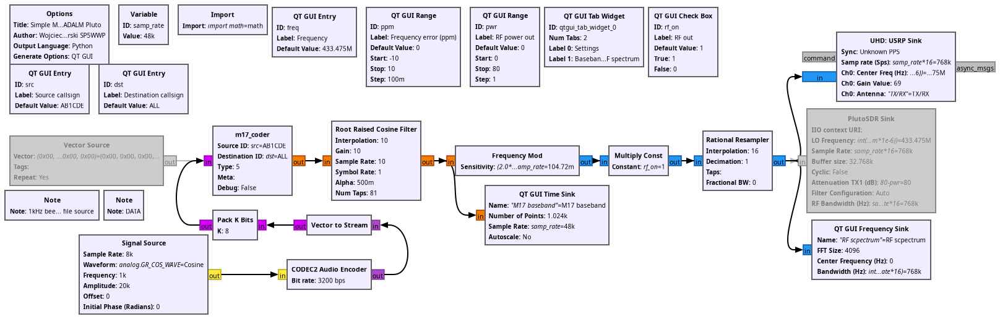
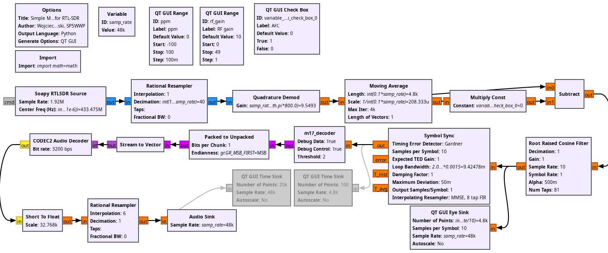

## gr-m17 examples

For a first test, jump to ``m17_loopback.grc`` which does not use external tools but is GNU Radio only.
The two ``m17_rx.grc`` and ``m17_tx.grc`` are for debugging and validation purposes of the conversion
from ``libm17`` to GNU Radio block.

### m17_rx.grc


This receiver testing example relies on ``../M17_Implementations/SP5WWP/m17-coder/m17-coder-sym``
to broadcast a signal. Following this unit testing example, run this flowchart along with
```
mkfifo /tmp/fifo1
mkfifo /tmp/fifo2
python3 ../M17_Implementations/SP5WWP/grc/m17_streamer.py
../M17_Implementations/SP5WWP/m17-coder/m17-coder-sym < /tmp/fifo1 > /tmp/fifo2 &
```

and the output of ``python3 ./m17_rx.py`` should be 

```
...
DST: ALL       SRC: AB1CDE    TYPE: 0005 META: 0000000000000000000000000000 LSF_CRC_OK 
DST: ALL       SRC: AB1CDE    TYPE: 0005 META: 0000000000000000000000000000 LSF_CRC_OK 
DST: ALL       SRC: AB1CDE    TYPE: 0005 META: 0000000000000000000000000000 LSF_CRC_OK 
DST: ALL       SRC: AB1CDE    TYPE: 0005 META: 0000000000000000000000000000 LSF_CRC_OK 
DST: ALL       SRC: AB1CDE    TYPE: 0005 META: 0000000000000000000000000000 LSF_CRC_OK 
...
```

It would be wise to execute from a terminal rather than the GNU Radio Companion graphical interface
to avoid flooding the console.

### m17_tx.grc


This transmitter testing example relies on ``../M17_Implementations/SP5WWP/m17-decoder/m17-decoder-sym``
to decode a signal. Following this unit testing example, run this flowchart along with
```
mkfifo /tmp/fifo1
mkfifo /tmp/fifo2
../M17_Implementations/SP5WWP/m17-decoder/m17-decoder-sym < /tmp/fifo2
```

and the output of ``python3 ./m17_tx.py`` should be 
```
DST: AB2CDE    SRC: AB1CDE    TYPE: 0005 META: 48656C6C6F210000000000000000 LSF_CRC_OK 
FN: 0018 PLD: 01020304050600000000000000000000 e=0.0
FN: 0019 PLD: 01020304050600000000000000000000 e=0.0
FN: 001A PLD: 01020304050600000000000000000000 e=0.0
FN: 001B PLD: 01020304050600000000000000000000 e=0.0
FN: 001C PLD: 01020304050600000000000000000000 e=0.0
FN: 001D PLD: 01020304050600000000000000000000 e=0.0
DST: AB2CDE    SRC: AB1CDE    TYPE: 0005 META: 48656C6C6F210000000000000000 LSF_CRC_OK 
FN: 001E PLD: 01020304050600000000000000000000 e=0.0
```

### m17_loopback.grc

Loopback demo with TX and RX both in GNU Radio.


The output should be 

```
DST: AB2CDE    SRC: AB1CDE    TYPE: 0005 META: 48656C6C6F210000000000000000 LSF_CRC_OK 
DST: AB2CDE    SRC: AB1CDE    TYPE: 0005 META: 48656C6C6F210000000000000000 LSF_CRC_OK 
DST: AB2CDE    SRC: AB1CDE    TYPE: 0005 META: 48656C6C6F210000000000000000 LSF_CRC_OK 
DST: AB2CDE    SRC: AB1CDE    TYPE: 0005 META: 48656C6C6F210000000000000000 LSF_CRC_OK 
DST: AB2CDE    SRC: AB1CDE    TYPE: 0005 META: 48656C6C6F210000000000000000 LSF_CRC_OK 
DST: AB2CDE    SRC: AB1CDE    TYPE: 0005 META: 48656C6C6F210000000000000000 LSF_CRC_OK 
```

### m17_loopback_noisy.grc

Loopback demo with the addition of noise, no modulation/no channnel.


### m17_loopback_noisychannel.grc

Loopback demo with a noisy channel, including full modulation & demodulation.


### transmitterPLUTOSDR.grc

M17 transmitter with ADALM Pluto SDR or Ettus Research B210.



### receiverRTLSDR.grc

M17 receiver with RTL-SDR. Automatic Frequency Correction can be enabled as an option.



### Complete demonstration

Resulting demonstration of wireless communication between a B210 emitting the signal and RTL-SDR dongle
as receiver.


