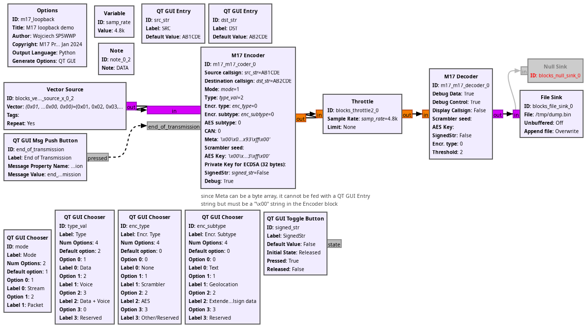

## gr-m17 examples

### transmitterPLUTOSDR.grc
M17 transmitter with ADALM Pluto SDR.

### receiverRTLSDR.grc
M17 receiver with RTL SDR. Automatic Frequency Correction can be enabled as an option.

### m17_streamer.grc
Old loopback demo.

### m17_loopback_noisychannel.grc
Loopback demo with the addition of noise, no modulation/no channnel.

### m17_loopback_noisychannel.grc
Loopback demo with a noisy channel, including full modulation & demodulation.

